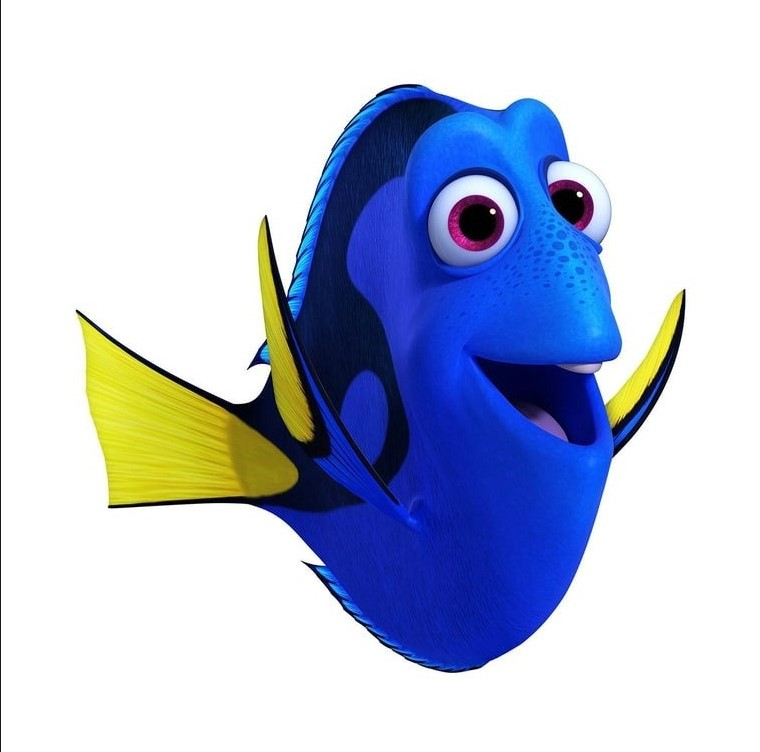

# ↪ RETURNS
## 머신러닝 기반 보험 가입 고객 이탈 예측 및 유지 전략 제안 프로젝트

## 📑 목차 (Table of Contents)
1. [📌 프로젝트 개요](#1-프로젝트-개요)
2. [🖐🏻 팀 소개](#2-팀-소개)
3. [🛠 기술 스택](#3-기술-스택)
4. [📊 데이터 분석 및 전처리](#4-데이터-분석-및-전처리)
5. [🧠 모델링 및 평가](#5-모델링-및-평가)
6. [📈 주요 기능 및 화면](#6-주요-기능-및-화면)
7. [📁 프로젝트 구조](#7-프로젝트-구조)

## 1. 📌 프로젝트 개요

📋 서비스 배경

- 보험 산업에서 신규 고객 유치 비용은 기존 고객 유지 비용보다 약 5~7배 더 높습니다.\
Team RETURNS는 보험사의 유지율(Retention Rate)을 극대화하기 위해 데이터 기반의 이탈 예측 솔루션을 제안합니다.

🎯 핵심 목표
- B2B 솔루션: 보험사가 보유한 방대한 고객 데이터를 활용하여, 해지 가능성이 높은 고객을 사전에 식별합니다.
- 비즈니스 가치: 신규 고객 유치보다 효율적인 **기존 고객 유지(Retention)** 를 통해 보험사의 운영 비용을 절감하고 손해율을 관리합니다.
- 데이터 기반 의사결정: 단순 감이 아닌, 머신러닝 모델이 산출한 이탈 확률을 바탕으로 마케팅 자원을 집중 투입합니다.

💡 기대 효과
- 이탈률 감소: 데이터 기반의 타겟팅을 통한 효율적인 고객 관리
- LTV(고객 생애 가치) 증대: 장기 가입 고객 확보를 통한 보험사 수익성 개선

## 2. 🖐🏻 팀소개
##  Team RETURNS
<table align="center">
  <tr>
    <td align="center" width="120">
      
    </td>
    <td align="center" width="120">
      
    </td>
    <td align="center" width="120">
      
    </td>
    <td align="center" width="120">
      
    </td>
    <td align="center" width="120">
      
    </td>
    <td align="center" width="120">
      
    </td>
  </tr>
  <tr>
    <td align="center"><b>김이선</b></td>
    <td align="center"><b>박은지</b></td>
    <td align="center"><b>박기은</b></td>
    <td align="center"><b>이선호</b></td>
    <td align="center"><b>위희찬</b></td>
    <td align="center"><b>홍지윤</b></td>
  </tr>
  <tr>
    <td align="center">FullStack</td>
    <td align="center">DB</td>
    <td align="center">FullStack</td>
    <td align="center">PM</td>
    <td align="center">FullStack</td>
    <td align="center">FullStack</td>
  </tr>
  <tr>
    <td align="center"><a href="https://github.com/kysuniv-cyber"></a></td>
    <td align="center"><a href="https://github.com/lo1f0306"></a></td>
    <td align="center"><a href="https://github.com/gieun-Park"></a></td>
    <td align="center"><a href="https://github.com/fridayeverynote-cell"></a></td>
    <td align="center"><a href="https://github.com/dnlgmlcks"></a></td>
    <td align="center"><a href="https://github.com/jyh-skn"></a></td>
  </tr>
</table>


## 3. 🛠 기술스택
- Language & Analysis:     


- Machine Learning: 
  - Core Model: HistGradientBoostingClassifier 
  

- Service: - **Service:**   

## 4. 📊 데이터 분석 및 전처리
📊 데이터셋 구성 (Dataset Overview)
본 프로젝트는 보험 고객의 행동 데이터를 분석하여 이탈 확률을 예측하기 위해 Parquet 형식의 고성능 데이터셋을 활용했습니다.

- 데이터 규모: 약 40여 개의 피처(Features)로 구성된 고객별 보험 유지/청구 이력 데이터.
- 파일 형식: 대용량 데이터의 입출력 속도 향상 및 데이터 타입 보존을 위해 Apache Parquet 채택.

| 영역 | 주요 항목 (Features) | 비즈니스 의미 |
|---|---|---|
| 고객 프로필 | `region_name`, `age_band`, `tenure` | 지역별 / 연령대별 / 가입 기간별 고객 성향 파악 |
| 보험 및 청구 | `current_premium`, `num_claims_12m` | 현재 납입료 수준 및 최근 1년 내 서비스 이용 빈도 측정 |
| 리스크 지표 | `complaint_flag`, `late_payment_count` | 민원 발생 및 보험료 연체 등 직접적인 이탈 징후 포착 |
🛠️ 데이터 전처리 및 분석 (EDA & Processing)
모델 성능 최적화를 위해 다음과 같은 분석과 가공 과정을 거쳤습니다.

1. 중복성 제거 (Feature Selection):
- total_payout_amount_12m와 total_claim_amount_12m처럼 상관관계가 1.0인 중복 지표를 정리하여 모델 복잡도 감소.

2. 타겟 지표 생성:
- 단순 이탈 여부(0, 1) 외에 모델이 산출한 churn_probability(이탈 확률)를 기반으로 위험 등급(Risk Tier) 도출 로직 설계.

3. 데이터 정제:
- 학습에 불필요한 고유 식별값(customer_id) 및 기준일(as_of_date)을 제거하여 모델의 일반화 성능 향상.

4. 범주형 변수 처리:
- region_name(지역명), policy_type(상품 유형) 등급의 텍스트 데이터를 머신러닝 모델이 이해할 수 있도록 인코딩 수행.
## 5. 🧠 모델링 및 평가

🏗️ 모델 구성 및 전략

- 사용 모델: HistGradientBoostingClassifier

- 모델 특성: * 정형 데이터 학습에 최적화된 히스토그램 기반 알고리즘을 통해 수만 건의 데이터를 고속으로 처리.

  - Scikit-learn 파이프라인과 ColumnTransformer를 활용하여 전처리부터 예측까지의 과정을 모듈화.

  - 버전 호환성 패치: Persisted Imputer 패치를 통해 sklearn 1.7.x와 1.8.x 간의 런타임 호환성 확보.

📈 모델 성능 결과\
테스트 데이터셋을 기준으로 산출된 주요 평가지표는 다음과 같습니다.

| Metric    | Value | Description                       |
| --------- | ----- | --------------------------------- |
| Accuracy  | 0.572 | 전체 예측 중 정답을 맞춘 비율                 |
| Precision | 0.406 | 이탈이라고 예측한 고객 중 실제 이탈자의 비율         |
| Recall    | 0.901 | 실제 이탈자 중 모델이 찾아낸 비율 (핵심 성과 지표)    |
| F1-Score  | 0.559 | Precision과 Recall의 조화 평균          |
| ROC-AUC   | 0.790 | 이탈 고객과 유지 고객을 구분하는 모델의 전반적인 분류 성능 |

### 🔍 Key Insight

* 모델은 **Recall(0.901)** 을 높게 유지하도록 설계되었습니다.
* 이는 **실제 이탈 고객을 최대한 많이 탐지하는 것**을 목표로 한 설정입니다.
* 고객 이탈 예측 문제에서는 **이탈자를 놓치는 것(False Negative)** 이 더 큰 비용을 초래할 수 있기 때문에 Recall이 중요한 지표입니다.


## 6. 📈 주요 기능 및 화면

## 7. 📂 프로젝트 구조 (Project Structure)

```text
PRED-CUST-CHURN/
├── data/                    # 데이터 폴더
├── analysis/                # 개별 가설 분석 폴더
├── src/                     # 공통 모듈 (팀원 공유용)
│   └── preprocess.py        # 데이터 로드 및 전처리 클래스
├── pages/                   # Streamlit 웹 어플리케이션
│   ├── churn_predictor.py   # 이탈 예측 화면
│   ├── entry.py             # 진입 화면
│   └── risk_watchlist.py    # 이탈 확률이 높은 고객 리스트 화면
├── model/                   # 학습된 모델 저장 폴더
├── requirements.txt         # 필요 라이브러리 목록
└── app.py                   # 실행 streamlit
]()